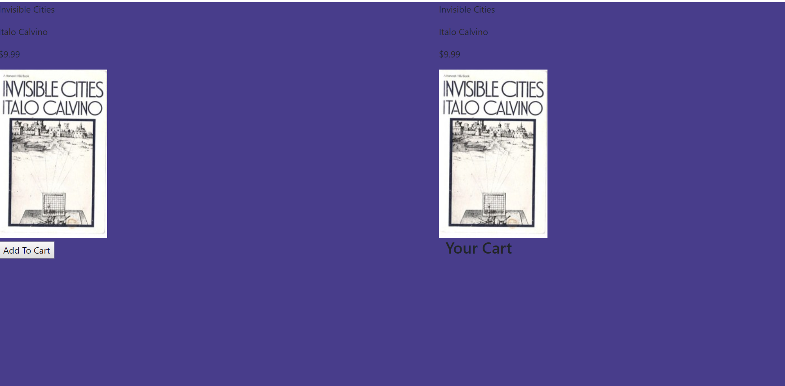

# Almost amazon

This site is the superior version of Amazon.  It has a single book you can choose to look at and can add to your cart.  It was built as an exercise in using modular js design.

## Screenshots


## How to run this project
* Use npm to install http-server in your terminal:
```sh
npm install -g http-server
```
* Run the server
```sh
hs -p 9999
```
* Open chrome and navigate to:
```
localhost:9999
```
* Click the add to cart button to move the book to your cart which will be displayed on the right side of the page.